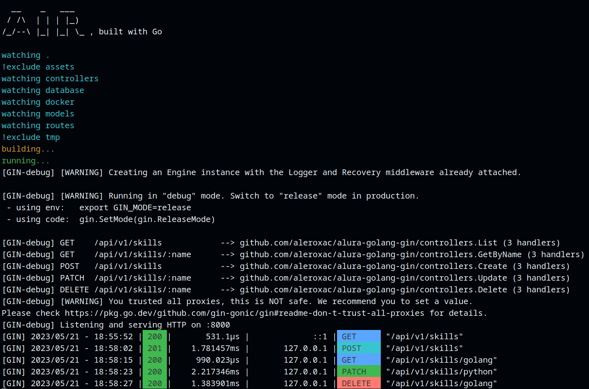
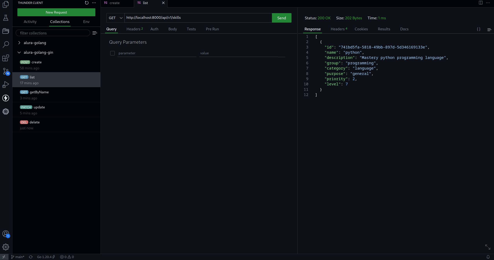
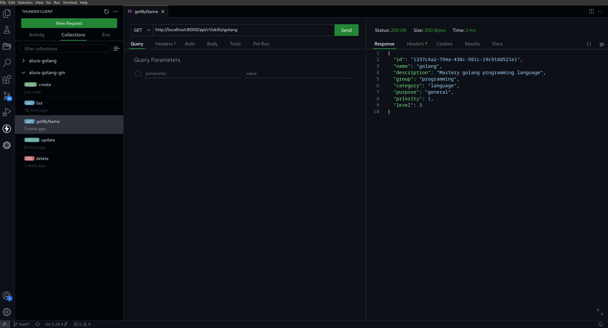
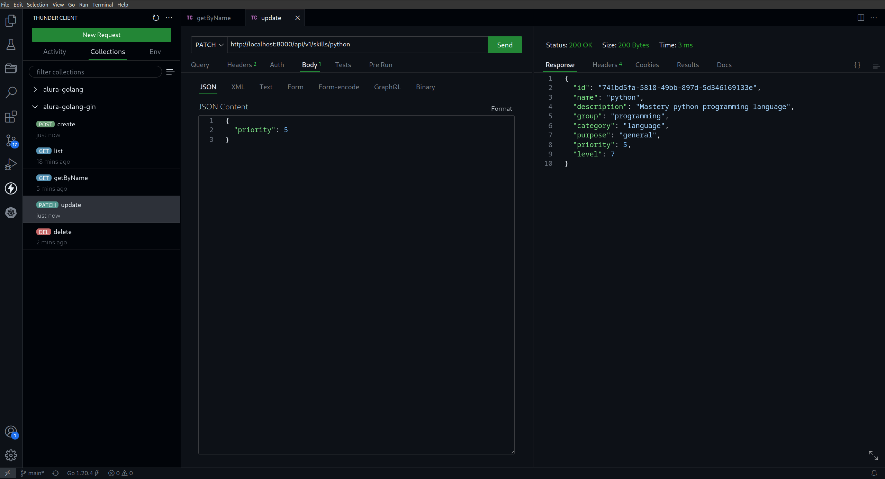
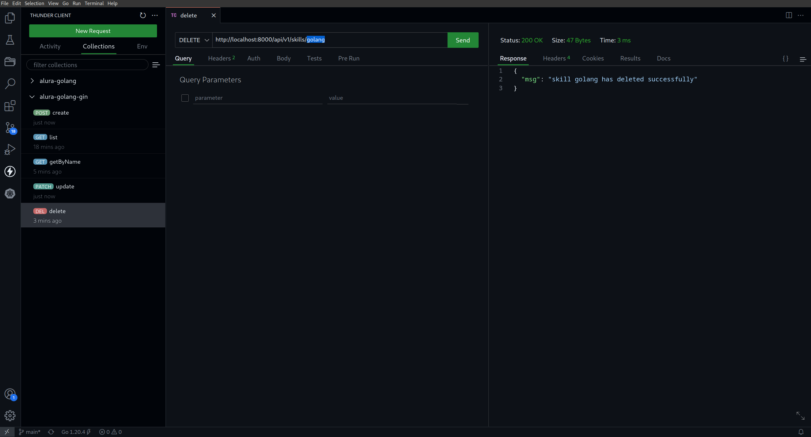

# alura-golang-gin
Projeto desenvolvido com base no treinamentos de Golang com Gin Gonic na plataforma Alura.




## Estrutura de pastas
```
.
├── assets
│   ├── app-on-air.png
│   ├── create_skill.png
│   ├── delete_skill.png
│   ├── get_skill_by_name.png
│   ├── list_skills.png
│   ├── thunder-collection_alura-golang-gin.json
│   └── update_skill.png
├── controllers
│   └── controllers.go
├── database
│   └── database.go
├── docker
│   ├── docker-compose.yaml
│   └── Dockerfile
├── go.mod
├── go.sum
├── main.go
├── Makefile
├── models
│   └── skills.go
├── README.md
└── routes
    └── routes.go
```


## Modo de uso
``` shell
## faça o build da imagem
make build

## suba os containers via docker-compose
docker-compose -f docker/docker-compose.yaml up -d
```


## CRUD
### Listar skills

### Buscar skill por nome

### Atualizar skill

### Remover skill



## Temas abordados
- API REST: net/http
- Framekwork Web: gin
- ORM: gorm


## O que fiz de diferente
- Entidade principal skill
- CLI air, para live-reloading
- Collection para o ThunderClient
- Makefile
- Dockerfile
- String de conexão sendo composta por variáveis de ambiente, ao invés de uma string pura
- Rota /api/v1/healthz
- Campo ID do tipo UUID
- Busca por nome da skill, ao invés do ID
